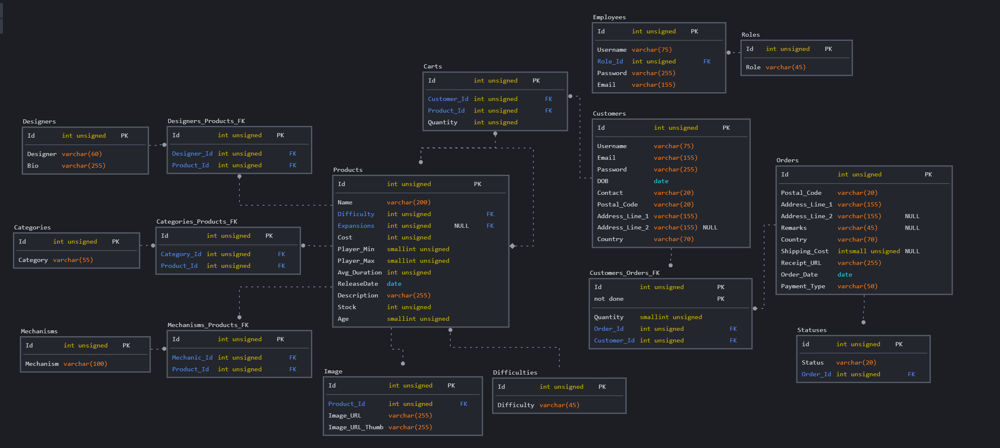

# Tic-tax-toe
  
Table of Contents

  <ol>
    <li>
      <a href="#about-the-project">About the Project</a>
      <ul>
        <li><a href="#goals">Goals</a></li>
        <li><a href="#target-audience">Target audience</a></li>
      </ul>
    </li>
    <li>
    <a href="#ui-and-ux">UI and UX</a>
    <ul>
        <li><a href="#design">Design</a></li>
        <li><a href="#database">Database</a></li>
    </ul>
    </li>
        <li>
        <a href="#features">Features</a>
        </li>
        <li><a href="#built-with">Built With</a></li>
        <li><a href="#frontend">Frontend Testing</a></li>
        <li><a href="#backend">Backend Testing</a></li>
        <li><a href="#credit">Credit</a></li>
  </ol>

## About the Project
As the popularity of table top games soars over the past few years, more and more adults have found themselves searching for boardgame online to purchase. Being a fan myself, more often than not, we would go to site like amazon to find what we are searching for.  

This website will benefit people in similar circumstances by giving them a one stop shop to meet their table top needs.

The demo of the live frontend website can be accessed here:
[TicTaxToe](https://tictaxtoe.netlify.app/)
 
The demo of the live backend website can be accessed here:
[TicTaxToeAdmin](https://tictactoeadmin.onrender.com/)

(<a href="#tic-tax-toe"> Back to top </a>)

## Goals 
### Organization's goals
 In this age of technology, people should not spend ages online just to find some thing that they want. This site will provide an ease-of-access to users and spark progression in the table top community.

 Most importantly to show they table top games are not just for kids.

### User's goals
Our target audience seeks to cut down on searching time done online by going to multiple forums and shops.

Below are some user stories:
| User Stories | Accceptance Criteria |
| ----------- | ----------- |
| New user wanting to get into the table top games (TTG)  | User can find products that have a gentle learning curve. |
| Veteran users looking for the next product made my their favourite creator  | A simple search can be use to filter the result to show what the users are looking for.|
| Ease of tracking product status after purchase | Website allow user keep track of their purchases|

(<a href="#tic-tax-toe"> Back to top </a>)

## Target audience
Our target audience:
* *Teenagers and adults*
* *New and interested player in the TTG community*
* *Seasonal players looking to expand their collections* 

(<a href="#tic-tax-toe"> Back to top </a>)

## UI and UX
The aim of the this application is to create a simple and easy to use and understand layout with image and words from the site to be the main actors. Forming a theme and developing a wireframe.

## Design
### Colors

We decided to use an array of colors that are more slick and give a vibe of maturity to appel to our target audience.

As for the fonts, we used **Press Start 2P** as we still want user to know this is a TTG site and **Montserrat** to deal with the readability of the sites.

(<a href="#tic-tax-toe"> Back to top </a>)

## Database

The databasehave gone through multiple iterations and improvements. Many changes have been made compared to the one shown above. 

(<a href="#tic-tax-toe"> Back to top </a>)

## Features

On the landing page, the user will be greeted with welcome page before proceeding on.

| Features | Status | Description |
| --- | --- | ---- |
| Product | DONE | User can find all the products on sales|
| Filtering Search | DONE | Filter search for products based on what the user wants eg. Name, Cost, categories. |
| Login | DONE | Being a e-comm, website allow user to create and login to make purchases. |
| Add to cart | DONE | After logging in, the user can add products to cart for purchase later |
| Payment for their purchases | DONE | User can checkout and purchase the products |
| Track their order status | DONE | User can view they order status and receipt |
| Group order | NOT IMPLEMENTED | Multiple users can pool their cart together before submitting the order |

(<a href="#tic-tax-toe"> Back to top </a>)

## Built With
* [Visual Studio Code](https://code.visualstudio.com/)
    - A free and easy to use coding programme for beginners
  

* [GitPod](https://www.gitpod.io/)
    - Allow access to coding programme on mutiple computers
  

* [React](https://reactjs.org/)
    - Well written documentation and multiple videos tutorials regarding its use.
    - Multi easy to use add-ons
  

* [Express](https://expressjs.com/)
    -  Designing and Building web applications quickly and easily
  

* [Axios](https://axios-http.com/docs/intro)
    - Ability to intercept HTTP requests. 
  

* [Bootstrap 5](https://getbootstrap.com/) & [Bootstrap-icon](https://icons.getbootstrap.com/) 
    - Designed to enable responsive development of mobile-first websites
  

* [ReactToastify](https://www.npmjs.com/package/react-toastify)
    - Enable creation beautiful and interactive visualizations of data
  

* [CLIP STUDIO PAINT](https://www.clipstudio.net/)
    - Selections of varying feature create by the software and users that is used for image editing.
  

* [Cloudinary](https://cloudinary.com/)
    - Allow to upload pictures
  

* [Stripe](https://stripe.com/en-sg)
    - Help with the process of payment for orders. Have a test version to use before actual cash is used
  

* [YUP](https://github.com/jquense/yup)
    - Easy to use input validation
  

* [Render](https://render.com/)
    - Free Deployment for Backend server
  

* [Netlify](https://www.netlify.com/)
    - Free Deployment for React App 
  

(<a href="#tic-tax-toe"> Back to top </a>)

## Frontend
### Test Account

Front End:
- username: cus1@gemail.com
- paswword: asd123
  

Show Test Cases - Accounts

|Test Case|Steps|Results|
|---|---|---|
|Loading of Site|<ol><li>Go to [TicTaxToe](https://tictaxtoe.netlify.app/)</li></ol>|<ol><li>The website should load without issue</li></ol>|
|Create an Account|<ol><li>Land on the website landing page</li><li>Click "Login/Register" on the navbar</li><li>Click on the "Create account"</li><li>Fill in the information and click create</li></ol>|<ol><li>Landing page will show a Nav bar and an image in the center</li><li>After step 2, a new page will appear</li><li>After step 3 a form will appear on a new page.</li><li>If form is not filled properly, doing step 4 will prompt an error. If everything is successful, an message will appear</li></ol>|
|Logging in|<ol><li>Click "Login/Register" on the navbar</li><li>Fill in account info and click login</li></ol>|<ol><li>A new page will appear showing a login form</li><li>If information entered is correct, user will see the main page and a welcome message. Else a error message will appear and the user will not be redirected</li></ol>|
|Logging out|<ol><li>Click "Logout" on the navbar</li></ol>|<ol><li>User will be moved to the main page and an message will appear informing user that they have logged out</li></ol>|

 

Show Test Cases - Shopping Cart (After logging in)

|Test Case|Steps|Results|
|---|---|---|
|Filter & search for product|<ol><li>After logging in, the click the product tab on the nav bar</li><li>User can choose to do a simple search or click the advance search button</li><li>Fill in the search filter form</li><li>Click the search button</li><li>Click the reset button</li></ol>|<ol><li>User will see a new page showing all the products</li><li>Additional search input will appear on the screen.</li><li>After step 3, if there are products that matches the search results, the filtered products will be shown. If there are not products, there will be a message informing the user that no products were found</li><li>After step 5, the product page will return back to showing all the products</li></ol>|
|Add product to cart|<ol><li>After logging in, the click the product tab on the nav bar</li><li>Click the add to cart button on the product you wish to purchase.</li></ol>|<ol><li>User will see a new page showing all the products</li><li>After step 2, a message will appear if item have been successfully added. If user is not logged in, a message will prompt the user to login in order to add items to cart</li></ol>|
|View cart|<ol><li>After logging in, the click the cart icon on the nav bar</li></ol>|<ol><li>if user is not logged in, there will not be a cart icon</li><li>After step 1, an off-canvas will appear showing the cart of the user</li></ol>|
|Edit quantity|<ol><li>After logging in, the click the cart icon on the nav bar</li><li>Click on the update quantity button</li><li>Change the value in the input and click confirm quantity</li></ol>|<ol><li>if user is not logged in, there will not be a cart icon</li><li>After step 1, an off-canvas will appear showing the cart of the user</li><li>After step 2, an input box will appear with another button</li><li>After step 3, the quantity on the product will be updated</li></ol>|
|Remove item from cart|<ol><li>After logging in, the click the cart icon on the nav bar</li><li>Click on the "X" button on the top right of the product you wish to remove.</li></ol>|<ol><li>if user is not logged in, there will not be a cart icon</li><li>After step 1, an off-canvas will appear showing the cart of the user</li><li>A message will appear inform of a successful removal of the product from the cart after step 2.</li></ol>|

 

Show Test Cases - Checking out and Orders  (After logging in)

|Test Case|Steps|Results|
|---|---|---|
|Checking out of cart|<ol><li>After logging in, the click the cart icon on the nav bar</li><li>Click the checkout button at the bottom of the cart off-canvas</li><li>Input all the required fields of addresses and payment information</li><li>Click the proccess payment button</li></ol>|<ol><li>User will see a their cart</li><li>Click the checkout button with an empty cart will prompt a message telling the user that their cart is empty. Else, they will be redirect to stripe payment page</li><li>After step 4, they will be redirected to they orders page, with a message informing the user of their success or failure of their payment</li></ol>|
|View Orders status|<ol><li>After logging in, the click "My Order" on the nav bar</li></ol>|<ol><li>if user is not logged in, there will not be a "My Order" tab</li><li>User will be redirected to another page showing all the customers orders</li><li>The status of the order can be seen at the end of the table or referanced from the color of the row</li></ol>|
|View Orders receipt|<ol><li>After logging in, the click "My Order" on the nav bar</li><li>Click on the receipt icon on the table related to the order</li></ol>|<ol><li>if user is not logged in, there will not be a "My Order" tab</li><li>User will be redirected to another page showing all the customers orders</li><li>After step 3. they will be redirected to another page showing the receipt of the order</li></ol>|

 

(<a href="#tic-tax-toe"> Back to top </a>)

## Backend
### Test Account

Back End
* Admin
    - username: tes1@gemail.com
    - paswword: asd123
  
* Management
    - username: tes2@gemail.com
    - paswword: asd123
  
* Staff
    - username: tes3@gemail.com
    - paswword: asd123
  

Show Test Cases - Accounts

|Test Case|Steps|Results|
|---|---|---|
|Loading of Site|<ol><li>Go to [TicTaxToeAdmin](https://tictactoeadmin.onrender.com/)</li></ol>|<ol><li>The website should load without issue</li></ol>|
|Create an Account|<ol><li>Land on the website landing page</li><li>Click "Sign up" on the navbar</li><li>Fill in the information and click create</li></ol>|<ol><li>Landing page will show a Nav bar</li><li>After step 2, a new page will appear with input form</li><li>If all informations is valid, the user will go to the login page with a message telling them the register was a success</li><li>If form is not filled properly, during step 3, it will prompt an error and not redirect the user to the login.</li></ol>|
|Logging in|<ol><li>Click "Login" on the navbar</li><li>Fill in account info and click login</li></ol>|<ol><li>A new page will appear showing a login form</li><li>If information entered is correct, user will see the a welcome message. Else an error message will appear</li></ol>|
|Logging out|<ol><li>Click "Logout" on the navbar</li></ol>|<ol><li>User will be informed of their successful logout</li></ol>|

 

Show Test Cases - Products Management (After logged in)

|Test Case|Steps|Results|
|---|---|---|
|View product|<ol><li>Click the all products at the top of the navbar</li></ol>|<ol><li>The user will be greeted with a table of all the products</li></ol>|
|Create product|<ol><li>Click the all products at the top of the navbar</li><li>Click on the create product button</li><li>Input the required fields and click create</li></ol>|<ol><li>The user will be greeted with a table of all the products</li><li>The user will go to a new page with a form</li><li>After step 3, if the validation is correct and successful, the page will hop back to the all product page with a message informing the successful creation of the product</li></ol>|
|Edit product|<ol><li>Click the all products at the top of the navbar</li><li>The staff need to be logged in order to edit.</li><li>Input all the changes and click confirm.</li></ol>|<ol><li>The user will be greeted with a table of all the products</li><li>If they are logged in as staff they will be able to click the update button</li><li>A new page will appear allowing the user to update the infomations</li><li>After step 3 the user will be directed back to the all product page with a message telling them the product have been edited</li></ol>|
|Delete product|<ol><li>Click the all products at the top of the navbar</li><li>The user need to be Management or higher to be able to click the delete button</li></ol>|<ol><li>The user will be greeted with a table of all the products</li><li>If the user is Management or higher they delete button will be red</li><li>A message will appear informing the user of the deletion</li></ol>|

 

Show Test Cases - View Customers and Staff (After logged in)

|Test Case|Steps|Results|
|---|---|---|
|View Customers|<ol><li>Click the all customers at the top of the navbar</li></ol>|<ol><li>The user will be greeted with a table of all the customers if they are not logged in they will be redirected to the employee login page</li></ol>|
|View Employees|<ol><li>Click the all Employees at the top of the navbar</li></ol>|<ol><li>The user will be greeted with a table of all the employees if they are not logged in they will be redirected to the employee login page</li></ol>|

 

Show Test Cases - Order Management (After logged in)

|Test Case|Steps|Results|
|---|---|---|
|View Order|<ol><li>Click the all orders at the top of the navbar</li></ol>|<ol><li>The user will be greeted with a table of all the orders if they are not logged in they will be redirected to the employee login page</li></ol>|
|Edit Order stauts|<ol><li>Click the all orders at the top of the navbar</li><li>Click the drop down list and select the status they wish to update to</li><li>Click confirm status</li></ol>|<ol><li>The user will be greeted with a table of all the orders if they are not logged in they will be redirected to the employee login page</li><li>After step 2 there will be a list of option to choose from</li><li>After step 3, the user will see a message telling them the successful update of the status</li></ol>|

 

(<a href="#tic-tax-toe"> Back to top </a>)

## Credit

Landing page top picture from:  
https://cloudfront.net/cumulus_uploads/entry/42805  

Photo by Jopwell: 
https://www.pexels.com/photo/group-of-people-sitting-inside-room-2422294/  

Images of all products from:  
https://boardgamegeek.com/  

Logo created by:  
https://looka.com/explore  

(<a href="#tic-tax-toe"> Back to top </a>)
